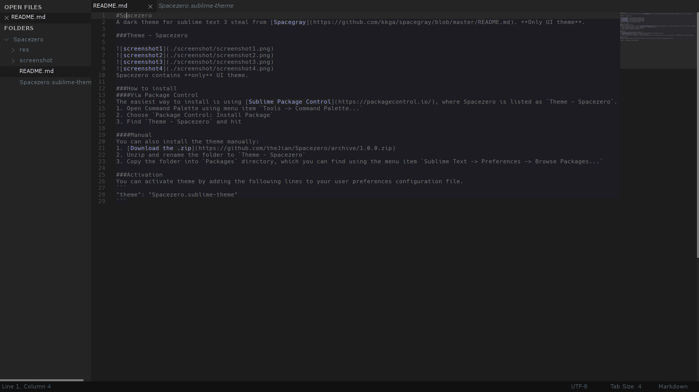
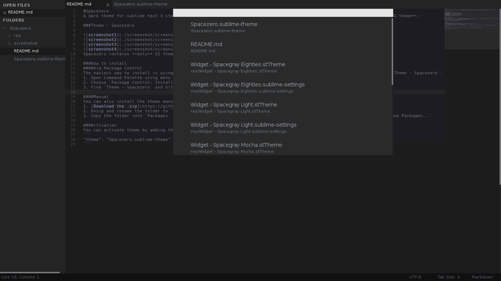
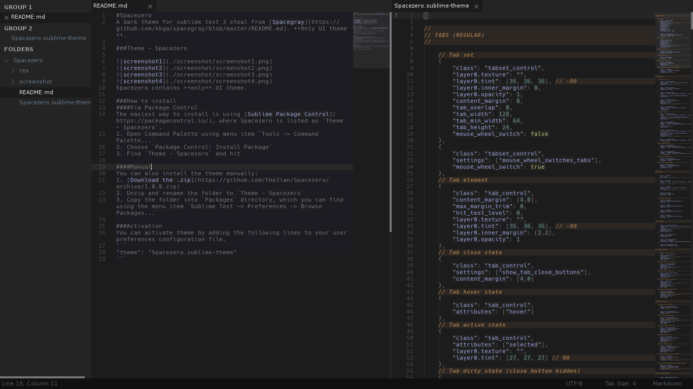

#Spacezero
A dark theme for sublime text 3 steal from [Spacegray](https://github.com/kkga/spacegray/blob/master/README.md). **Only UI theme**.

###Theme - Spacezero




Spacezero contains **only** UI theme.

###How to install
####Via Package Control
The easiest way to install is using [Sublime Package Control](https://packagecontrol.io/), where Spacezero is listed as `Theme - Spacezero`.
1. Open Command Palette using menu item `Tools -> Command Palette...`
2. Choose `Package Control: Install Package`
3. Find `Theme - Spacezero` and hit

####Manual
You can also install the theme manually:
1. [Download the .zip](https://github.com/theJian/Spacezero/archive/1.0.0.zip)
2. Unzip and rename the folder to `Theme - Spacezero`
3. Copy the folder into `Packages` directory, which you can find using the menu item `Sublime Text -> Preferences -> Browse Packages...`

###Activation
You can activate theme by adding the following lines to your user preferences configuration file.
```
"theme": "Spacezero.sublime-theme"
```